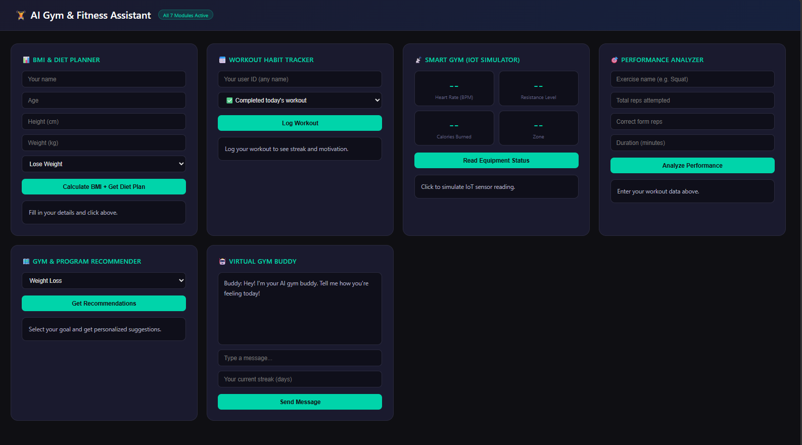

#  AI Gym & Fitness Assistant

An intelligent, multi-module AI-powered fitness and health ecosystem combining **FastAPI**, **MediaPipe Computer Vision**, **Predictive Machine Learning**, **IoT Telemetry Simulation**, and an interactive **Chart.js Dashboard**.



---

##  Key Modules & Capabilities

1. ** AI Gym Trainer**: Pose detection and real-time exercise rep counting via MediaPipe and joint-angle calculation.
2. ** AI Dietician & Nutrition Planner**: Automated BMI calculation with personalized daily caloric targets and meal plans based on fitness goals (Weight Loss, Muscle Gain, Maintenance).
3. ** Smart Gym (IoT Simulator)**: Real-time telemetry monitoring heart rate zones, resistance levels, and dynamic calorie burn rates.
4. ** Habit & Consistency Tracker**: Workout streak logging with machine learning skip-risk forecasting.
5. ** Virtual Gym Buddy**: Interactive conversational companion for motivation, form cues, and recovery guidance.
6. ** Performance & Form Analyzer**: Workout scoring engine analyzing rep cadence, form accuracy, and efficiency ratings.
7. ** Gym & Program Recommender**: Intelligent recommendation system matching fitness goals with targeted splits (PPL, 5x5, HIIT) and local facilities.

---

##  Tech Stack

| Layer | Technology |
|---|---|
| **Frontend** | Vanilla JavaScript, HTML5, CSS3, Chart.js |
| **Backend API** | Python 3.10+, FastAPI, Uvicorn, Pydantic |
| **AI / ML & Vision** | MediaPipe, OpenCV, Scikit-learn, NumPy |
| **Data Storage** | JSON-based audit and streak store (`workout_log.json`) |
| **Architecture** | RESTful Microservice Architecture with CORS integration |

---

## 📂 Project Structure

```
AI_gym/
├── demo_dashboard.png       # Dashboard screenshot preview
├── index.html               # Frontend dashboard UI (Chart.js + live telemetry)
├── main.py                  # Core FastAPI backend serving all 7 AI & IoT modules
├── workout_log.json         # Persistent user workout & streak logs
├── .gitignore               # Git rules for cache and virtual environments
└── README.md                # Project documentation
```

---

##  Quick Start Guide

### 1. Prerequisites
- Python 3.10 or higher
- Modern Web Browser (Chrome, Edge, Firefox, Brave)

### 2. Install Dependencies
```bash
pip install fastapi uvicorn pydantic
```
*(Optional for local CV pose estimation: `pip install opencv-python mediapipe`)*

### 3. Start the Backend API Server
```bash
uvicorn main:app --reload
```
The FastAPI backend will start at: `http://127.0.0.1:8000`  
Interactive Swagger API documentation: `http://127.0.0.1:8000/docs`

### 4. Launch the Frontend
Open `index.html` in your browser to start using the full dashboard.

---

## 🔌 API Endpoints Summary

| Method | Endpoint | Description |
|---|---|---|
| `GET` | `/` | API status and service module list |
| `POST` | `/bmi` | Calculate BMI and generate customized diet plan |
| `POST` | `/log-workout` | Log workout completion and calculate streak & skip risk |
| `GET` | `/workout-history/{user_id}` | Retrieve workout history logs |
| `GET` | `/equipment-status` | IoT telemetry simulation (Heart rate, zone, resistance) |
| `POST` | `/performance-score` | Analyze form accuracy, rep cadence, and efficiency |
| `GET` | `/recommend/{goal}` | Get recommended workout programs & facilities |
| `POST` | `/chat` | Chat with the Virtual Gym Buddy |

---

## 👨‍💻 Author
- **Dhyey Dave** ([GitHub: @dhyeyd1810](https://github.com/dhyeyd1810))
